# Hey, I'm Sezer :wave:

> I build things for humans, developers, and agents.

By day: backend engineer at **Paket Mutfak**, a ghost-kitchen company running on Python and good timing.

By night: shipping OSS — SDKs, framework contributions, and automations that save somebody, somewhere, a few hours.

Reach me at [hasansezertasan@gmail.com](mailto:hasansezertasan@gmail.com?subject=%5BGitHub%5D). I'm also on [LinkedIn](https://www.linkedin.com/in/hasansezertasan) and [Twitter](https://www.twitter.com/hasansezertasan) if that's your thing.

## Tech Stack

[][skillicons]

## Stats

<!-- Links -->

<!-- [fastapi-turkiye]: http://hasansezertasan.github.io/fastapi-turkiye -->
[skillicons]: https://skillicons.dev
